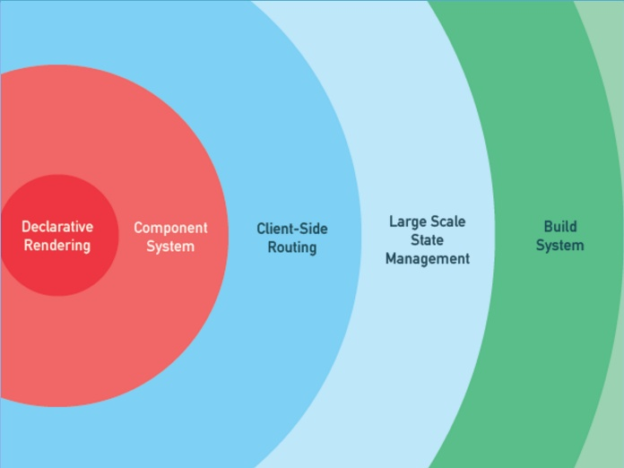

# [复习]Vue基础部分
>在复习基础部分前，先来了解一下vue的特点：
>1. vue是渐进式框架
>2. vue的声明式渲染
>3. vue只关注视图层（即`MVP、MVC、MVVM`中的M）

## 渐进式框架
渐进式可以理解为：`主张最少，只做自己该做的事`。vue只做视图层这块的工作，它并不要求你按照某种编程范式开发；而react，它主张函数式编程，你需要知道什么是副作用，什么是纯函数，如何隔离副作用。



## 声明式渲染
声明式渲染可以理解为：（两个要素）
1. 视图结构
2. 视图数据

`你只需定义好视图的结构和数据，剩下的工作交由vue完成。`

``` html
<!-- 定义好视图需要的HTML结构 -->
<div id="counter">
  count: {{ count }}
</div>
```
``` js
// 定义好视图需要的数据
const Counter = {
  data() {
    return {
      count: 0
    }
  }
}

Vue.createApp(Counter).mount('#counter')
```

## 只关注视图层
vue只对视图相关的变化做出反应，即它的数据响应式系统，路由管理交由vue-router完成，状态管理交由vuex管理，接口调用有对应的Controller层完成。
``` html
<div>
  count: {{ count }}
  <button @click="increase">increase</button>
</div>
```
``` js
// 数据发生变化，视图自动更新，整一个中心还是围绕视图如何更新
export default {
  data() {
    return { count: 0 }
  },
  increase() {
    this.count += 1
  }
}
```

## 梳理一下将要复习的vue的知识点：
- 模板语法
- computed vs watch
- 模板渲染
- class/style绑定
- 事件处理
- 表单输入绑定
- 组件及组件实例

### 模板语法
- 插值（作用：展示内容）
  - 文本：`<div>{{ name }}</div>`
  - HTML：`<span v-html="rawHtml" />`
  - 属性：`<div v-bind:id="id"></div>`
- 指令（当表达式的值发生改变时，产生的影响响应式作用于DOM）
  - v-if/v-show：是否显示
  - v-for：循环列表
  - v-on：绑定事件
    - 修饰符：`v-on:click.prevent="clickMe"`
    - 缩写：`@eventName`
  - v-bind：绑定属性
    - 动态参数：`v-bind:[attributeName]="url"`
    - 缩写：`:attributeName`
  - v-model：数据双向绑定。`默认value属性/input事件`

## computed vs watch
- computed（`响应式计算、缓存`）
  - 响应式计算：响应式数据发生变化会导致重新计算并渲染DOM
  - 缓存：依赖项发生变化才会重新计算表达式的值
- watch（`数据变化时导致的一些操作`）
  - 获取新旧值：(newVal, oldVal) {...}
  - 缓存

``` html
<div>{{ fullName }}</div>
```
``` js
Vue.createApp({
  // computed版本的fullName
  computed: {
    // 当firstName/lastName发生变化时，才会计算fullName
    fullName() {
      return this.firstName + ' ' + this.lastName
    }
  },
  // watch版本的fullName
  watch: {
    firstName(val) {
      this.fullName = val + ' ' + this.lastName
    },
    lastName(val) {
      this.fullName = this.firstName + ' ' + val
    }
  }
})
```

## 模板渲染
- v-if：表达式返回truthy时渲染
  - 支持template元素渲染：`<template v-if></template>`
  - 有v-else：`<div v-if>if</div>  <div v-else>else</div>`
  - 跟v-for同时使用：`v-if优先级更高`
- v-show：元素被渲染且保留在DOM中，只是`切换css的display属性`
  - ❌不支持template元素渲染
- v-for：列表渲染
  - 数组：`v-for="(item, index) in items"`
  - 对象：`v-for="(value, name, index) in myObject"`
  - 整数：`v-for="n in nums"`
  - 维护状态：数组每一项添加key
  - 变异更新：（`都是会改变原数组的方法`）
    - push()
    - pop()
    - shift()
    - unshift()
    - splice()
    - sort()
    - reverse()
  - template上使用：`<template v-for=""></template>`

## 事件处理
- 事件监听：`<div @click="">hello</div>`
- 事件绑定：
  - 事件句柄：`<div @click="hanldeClick">hello</div>`
  - 内联处理：`<div @click="alert('hello')">greet</div>`
  - 多事件：`<div @click="one($event), two($event)"></div>`
  - 修饰符：
    - .stop：阻止事件继续传播
    - .prevent：阻止默认事件
    - .capture：内部元素事件先触发，再交由外部元素处理
    - .self：只当在 event.target 是当前元素自身时触发
    - .once：只触发一次
    - .passive：是否阻止事件的默认行为
  - 按键修饰符：
    - .enter
    - .tab
    - .delete：删除/退格键
    - .esc
    - .space
    - .up
    - .down
    - .left
    - .right
  - 系统修饰符：
    - .ctrl
    - .alt
    - .shift
    - .meta
  - .exact修饰符：精确控制所需按键被触发后才执行
  - 鼠标修饰符：
    - .left
    - .right
    - .middle

## 表单输入绑定
明确一点：v-model指令是针对表单控件上创建的双向数据绑定。不同表单对应的`value`和`事件`是不一样的：
1. text和textarea：value和input事件
2. checkbox和radio：checked和change事件
3. select：value和change事件

v-model：
  - 表单控件有：
    - input
    - textarea
    - select
    - checkbox
  - 修饰符：
    - .lazy：在change事件时而非input事时更新
    - .number：转为数字
    - .trim：去掉空格
  - 组件上使用：`默认使用modelValue和update:modelValue事件`

自定义组件上使用v-model
``` js
const BaseInput = {
  components: { baseInput },
  props: {
    foo: String
  },
  template: `
    <input
      type="text"
      :value="foo"
      @input="$emit('update:foo', $event.target.value)"
    />
  `
})
```
``` html
<base-input v-model:foo="bar" />
```
